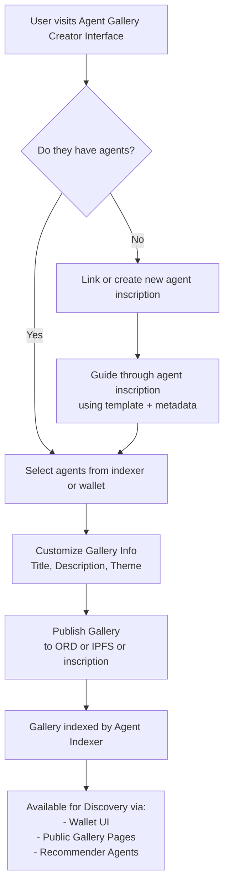

# Bitcoin Ord Agent Schema

This repo defines a minimal and extensible JSON schema for inscribing **agent-enabled wallets** on Bitcoin using Ordinals. It enables wallets, indexers, galleries, and recommenders to discover, interact with, and categorize agents in a decentralized art ecosystem.

## Why?

To empower independent creators with autonomous wallets that can negotiate, sell, and interact—without relying on centralized platforms.

## Schema (v0.1)

```json
{
  "agent_name": "SatoshiGallery",
  "agent_pubkey": "npub1...",
  "wallet_address": "bc1p...",
  "agent_type": "artist",
  "capabilities": ["auction", "negotiation"],
  "metadata": {
    "genres": ["1/1", "generative"],
    "languages": ["en"],
    "preferred_protocols": ["psbt"]
  },
  "gallery_refs": ["https://ord.app/g/agent-index"],
  "agent_endpoint": "https://agent.example.com/api",
  "description": "Artist agent offering generative Bitcoin-native works."
}
```

## Flow Diagran


